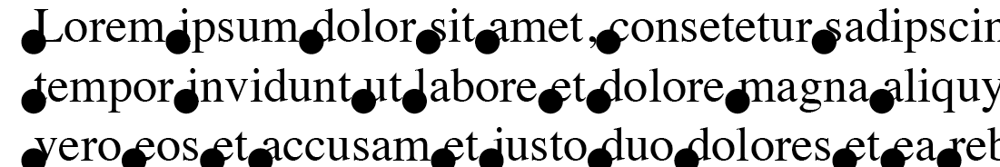
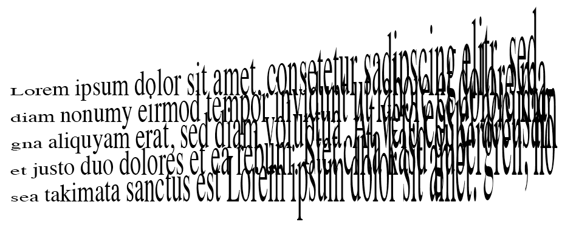

#Übungen #5

Macht bitte folgende Übungen bis zum nächsten Mittwoch. Wenn etwas nicht klappt, versucht euch untereinander zu helfen, zum Beispiel in der [Facebook-Gruppe «Script Design 2016 First Aid»](https://www.facebook.com/groups/1760227230910812/). Euren nicht funktionierenden Code könnt ihr dann in der [«Code Clinic»](https://github.com/typografie-haw-hamburg/Typografie-programmieren/tree/master/CodeClinic) hochladen, damit andere ihn sich ansehen können.

1. (**b.map()**) Ladet [dieses Script](https://github.com/typografie-haw-hamburg/Typografie-programmieren/blob/master/scripts/05_mapping.jsx) herunter. Es visualisiert eine Eingangsskala und eine Ausgangsskala. Auf der Eingangsskala wird ein zufälliger Punkt ausgewählt. Mittels `b.map() wird dann der entsprechende Punkt auf der Ausgangsskala berechnet.
  * Schaut euch das Script an und versucht seine Funktionsweise nachzuvollziehen. Ändert die Werte `inMin`, `inMax`, `outMin` und `outMax` und beobachtet, wie sich das Ergebnis jeweils verändert.
  * Ändert die Werte der Ausgangsskala so, dass `outMin` einen größeren Wert hat, als `outMax` und testet das Script. Der zufällige Wert wird jetzt umgekehrt auf die Ausgangsskala übertragen.
  * Ändert das Script so, dass der Punkt auf der Ausgangsskala seine Größe abhängig von seiner Position verändert: Landet der Punkt ganz links auf der Skala, soll er einen Durchmesser von 10 haben, landet er ganz rechts einen Durchmesser von 50. Für diese Änderung müsst ihr nur abändern, was in die Variable `diaOut` geschrieben wird und ihr benötigt dazu abermals den Befehl `b.map()`.

2. Erstellt drei `.txt`-Dateien mit verschiedenen Textinhalten. Schreibt ein Script, dass per zufälliger Auswahl einen dieser drei Texte in euer Dokument lädt. Dazu müsst ihr zunächst die Dateinamen der Textdateien als String in einen Array speichern. Bitte daran denken: Damit ihr Texte in euer Dokument laden könnt, muss das Dokument abgespeichert sein und die Texte müssen in einem Ordner namens `data` liegen, der neben eurem Dokument liegt.

3. Erweitert das Script aus der vorherigen Aufgabe. Zeichnet einen schwarzen Punkt in der linken unteren Ecke eines jeden neuen Worts (siehe Bild). Schaut euch dazu noch einmal [das Script](https://github.com/typografie-haw-hamburg/Typografie-programmieren/blob/master/scripts/05_words_circleWords.jsx) aus dem Kurs an, bei dem wir Kreise um ein Wort gezeichnet haben.

  * Ersetzt in eurem Script den Befehl `b.ellipse` durch `b.line` (behaltet einfach die gleichen Werte in den Klammern) und schaut euch an, wie sich das Ergebnis ändert.

  

4. (**Kreativaufgabe**) Versucht mit eurem Wissen über das bisher Gelernte eine interessante Gestaltung bzw. ein interessantes Muster per Script zu erstellen. In eurem Script soll Text bearbeitet/verändert werden. Speichert von diesem Design ein JPEG ab (Datei -> Exportieren -> Format JPEG -> Qualität Hoch | Auflösung(ppi): 72).

  * Benennt das exportierte JPEG `05_Kreativaufgabe_EuerName.jpg` und ladet es in [diesen Google Drive-Ordner](https://drive.google.com/open?id=0B6USBbEchpCkNGg3S1pyN0phLVE) hoch. Ladet euer Script bitte mit der Benennung `05_Kreativaufgabe_EuerName.jsx` in [den entsprechenden GitHub-Ordner](https://github.com/typografie-haw-hamburg/Typografie-programmieren/tree/master/Uebungen/Loesungen) hoch (oben auf `Upload files` klicken, Script in das Fenster ziehen, unten mit `Commit changes` abspeichern).

5. (**optionale Zusatzaufgabe**) Schreibt ein Script, in dem ihr `b.map()` mit Text kombiniert. Ein Beispiel: Mit Hilfe von `b.map()` könnte man ein Script schreiben, dass dem ersten Buchstaben einer Textzeile eine vertikale Skalierung («verticalScale») von 50% zuweist, und dem letzten eine von 600% (siehe Bild). Findet eine eigene Variante, diese kann natürlich auch für die Kreativaufgabe verwendet werden.

  